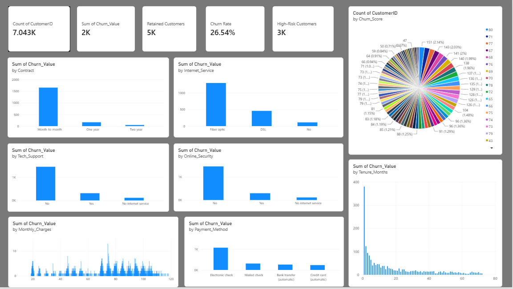
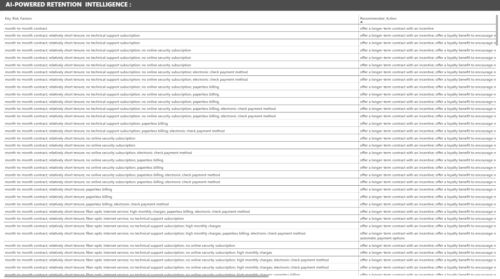

# RetainIQ

### Customer Churn & Retention Intelligence

An end-to-end data analytics project using **Python, SQL, Machine Learning and Power BI** to analyze customer churn, identify risk patterns and support retention decisions.

---

## 📊 Project Overview

RetainIQ transforms customer data into actionable business insights through data cleaning, SQL analysis, machine learning, retention intelligence and interactive visualization.

---

## 🎯 Project Objective

The goal of RetainIQ is to understand customer churn patterns, identify customers at higher risk of churn, and generate data-driven retention recommendations.

---

## 🛠️ Tech Stack

**Python** · **Pandas** · **Scikit-learn** · **MySQL** · **SQL** · **Power BI**

---

## 📈 Key Results

| Metric | Result |
|---|---:|
| 👥 Total Customers | **7,043** |
| 🔴 Churned Customers | **1,869** |
| 🟢 Retained Customers | **5,174** |
| 📉 Churn Rate | **26.54%** |
| 🤖 Model ROC-AUC | **82.91%** |

### Contract-level churn observed

| Contract Type | Customers | Churned | Observed Churn Rate |
|---|---:|---:|---:|
| Month-to-Month | 3,875 | 1,655 | 42.71% |
| One Year | 1,473 | 166 | 11.27% |
| Two Year | 1,695 | 48 | 2.83% |

These figures describe observed differences in the dataset and should not be interpreted as proof that contract type directly causes churn.

---

## 🔍 What the Project Analyzes

- Churn by contract type
- Churn by internet service
- Churn by payment method
- Churn by customer tenure
- Churn by tech support
- Churn by online security
- Monthly charges vs churn
- Customer risk distribution

---

## 🤖 Churn Prediction

A **Logistic Regression** model was developed to predict customer churn.

| Metric | Score |
|---|---:|
| Accuracy | **75.23%** |
| Precision | **52.38%** |
| Recall | **73.53%** |
| F1 Score | **61.18%** |
| ROC-AUC | **82.91%** |

---

## 💡 Retention Intelligence

RetainIQ generates data-driven retention recommendations using identified customer risk factors.

The recommendation system provides:

- Key risk factors
- Recommended retention actions
- Customer segments
- Retention priority

---

## 📊 Power BI Dashboard

The interactive Power BI dashboard provides insights into:

- Churn by Contract
- Churn by Internet Service
- Churn by Payment Method
- Churn by Tenure
- Churn by Tech Support
- Churn by Online Security
- Monthly Charges vs Churn
- Customer Risk Distribution
### Dashboard Preview



### AI Retention Intelligence



---

## 🚀 Workflow

**Data Cleaning** → **SQL Analysis** → **Churn Prediction** → **Retention Intelligence** → **Power BI Dashboard** → **Business Insights**

---

## 📁 Project Structure

```text
RetainIQ/
├── data/
├── docs/
├── power bi/
├── python/
├── screenshots/
├── sql/
└── README.md
```  
---

## 👩‍💻 Author

**Ishwarya baskar**

*Master of computer applications(MCA)*

*Aspiring Data Analyst | Python | SQL | Power BI | Excel| Machine Learning*
